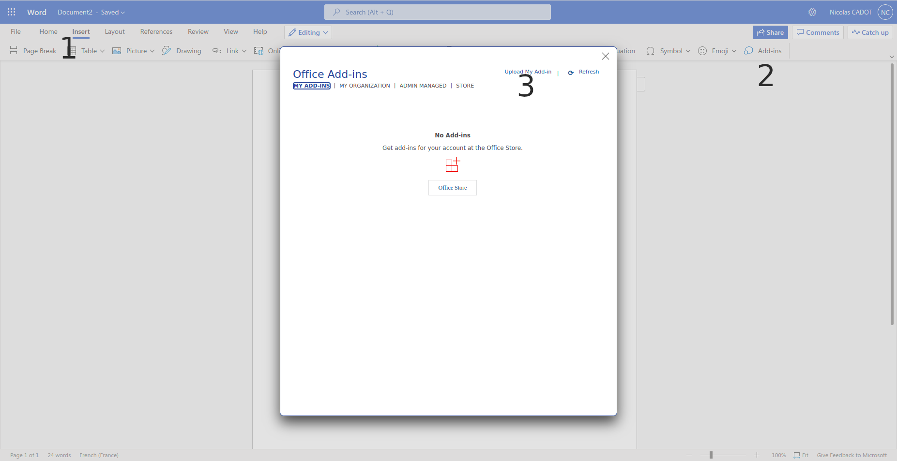
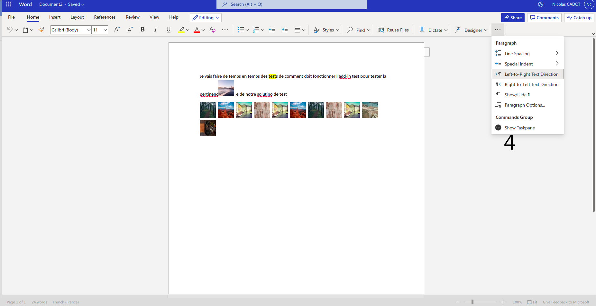

# testAddin
Test Microsoft Word Addin

1. Run `npm install`
2. Run `npm run dev-server`
3. Once your server is running you can go on a document on Web Word app
4. 1. Click on "Insert"
   2. Click on "Add-ins"
   3. Click on "Upload My Add-in"
   4. Choose the `manifest.xml` that is at the root of the project
   5. You can access the add-in in the Home ribbon

